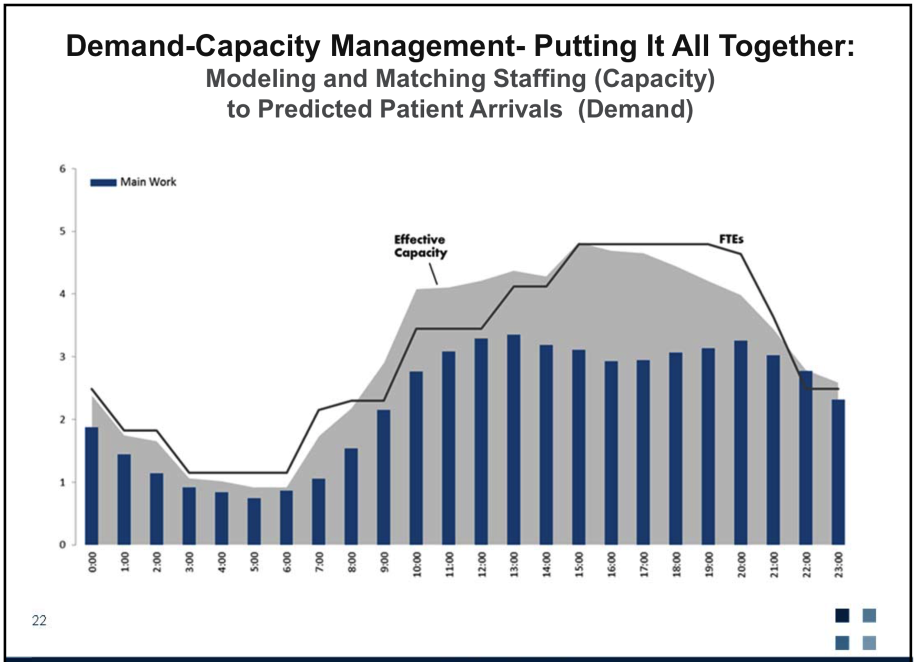

# ER Staffer

Anticipate patient demand and staff appropriately.

Staffing to eliminate peak loads entirely will put you out of business. Failing to staff to minimize peak loads will put you out of your contract.

__Objectives:__
1. Model and predict patient inflows using ML based on historic data
2. Automatically create staffing schedules based on the forecasted patient demand and provider profiles

### Structure

1. The app will automatically compile and process internal historical data, as well as external datasets such as weather, national epidemics, holidays, and traffic.
2. A machine-learning algorithm builds a statistical model that forecasts patient demand; this prediction is continually improved as new data is incorporated into the model.
3. An API links the predictive model to the staffing schedule system. Staffing managers have updated staffing suggestions in their scheduling tool based on time, date, and department.

### Development Plan:

- Dashboard app:
  - <a href='https://dash-gallery.plotly.host/dash-clinical-analytics/' > Plotly Template </a>
  - <a href='https://towardsdatascience.com/how-to-build-a-complex-reporting-dashboard-using-dash-and-plotl-4f4257c18a7f' > Complex Reporting Dashboard </a>
    - <a href='https://github.com/davidcomfort/dash_sample_dashboard'> code </a>

##  Staffing Optimization:

### Patient Arrivals
  - Understanding ED's patient volume, acuity, and patterns with __Demand Forecasting__. Demand Forecasting is the process in which historical data is used to develop an estimate of an expected forecast of (patient) demand. For hospitals, Demand Forecasting provides an estimate of the patient inflow in the foreseeable future. Critical assumptions about staffing, turnover, profit margins, cash flow, capital expenditure, risk assessment and mitigation plans, capacity planning, etc. are dependent on Demand Forecasting.
    - Hourly
    - Daily
    - Seasonal

### Provider Profile
  - How many patients per hour does the provider average?
  - Decisions: discharge / admittance per hour of shift

.

.

.
## Additional Notes:

__RVU__

Medicare uses a physician fee schedule to determine payments
for over 7,500 physician services. The fee for each service
depends on its relative value units (RVUs), which rank on a
common scale the resources used to provide each service. These
resources include the physician’s work, the expenses of the
physician’s practice, and professional liability insurance. To
determine the Medicare fee, a service’s RVUs are multiplied by a
dollar conversion factor.
1 Estimating and updating the RVUs is
a labor-intensive process because there are no readily available,
up-to-date data on the resource requirements of each service.

__ARIMA__

ARIMA stands for __AutoRegressive Integrated Moving Average__ It is a class of model that captures a suite of different standard temporal structures in time series data.